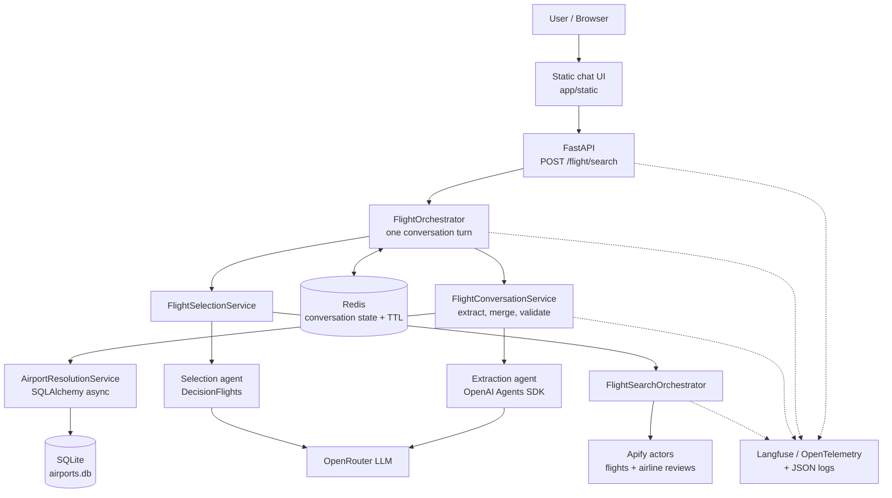
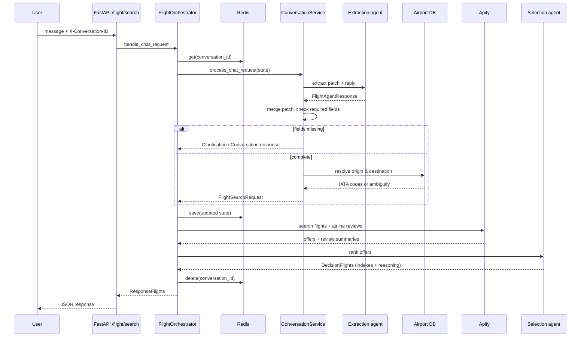
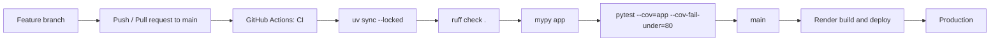
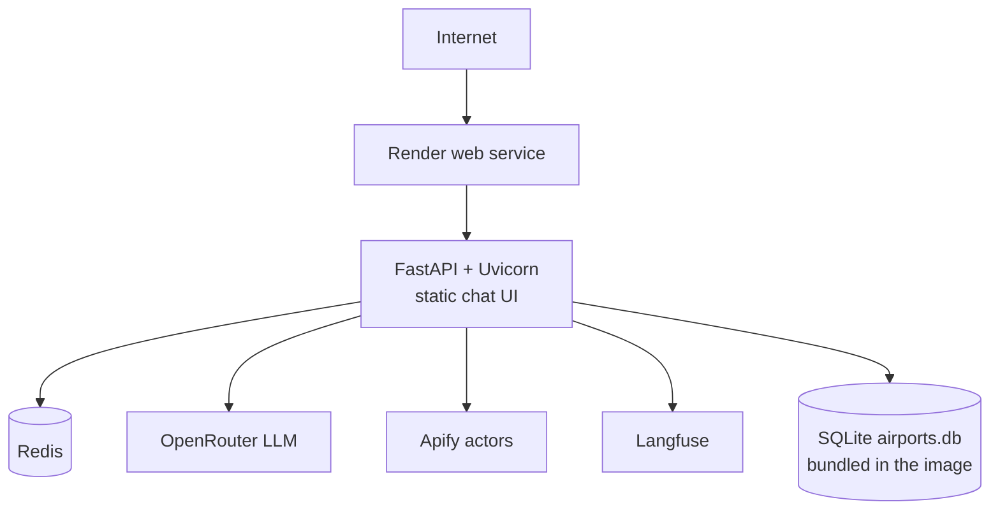

# AI Travel Agent

A conversational AI flight-search agent. Users describe a trip in natural language, and the application collects the missing details over multiple turns, resolves cities to airports, searches real flight offers, and asks an LLM agent to select and justify the best options. It runs as a live cloud application backed by FastAPI, Redis, Apify and an OpenRouter-hosted LLM.

**Live demo: https://ai-travel-agent-gvce.onrender.com**

[](https://www.python.org/)
[](https://fastapi.tiangolo.com/)
[](./dockerfile)
[](https://github.com/AnisMelki/ai-travel-agent/actions/workflows/ci.yml)
[](https://ai-travel-agent-gvce.onrender.com)

---

## Key Features

- **Conversational flight search** — a single chat endpoint (`POST /flight/search`) handles greetings, questions, corrections and search requests.
- **Multi-turn information collection** — the agent extracts `origin`, `destination`, `departure_date` and optional `return_date` incrementally; a search only starts once the required fields are present.
- **Conversation persistence** — each turn's state (collected fields, status, pending clarification, message history) is stored in Redis under a conversation id with a configurable TTL.
- **Airport resolution** — city names are resolved to IATA codes from a local SQLite airport database (exact city match, then a fuzzy fallback on code/city/airport name).
- **Clarification and recovery** — missing fields, unknown locations and ambiguous cities produce structured clarification responses, including selectable airport options, instead of failures.
- **Real flight data via Apify** — flight offers come from a Google Flights scraper actor; airline quality is enriched with Skytrax review summaries (best-effort per airline).
- **AI-based flight selection** — a second agent ranks the results on price, duration, layovers and airline reviews, returning two picks with written reasoning.
- **Observability** — every request is traced end-to-end in Langfuse via OpenTelemetry, with per-call latency, token usage and retry counts also emitted as structured JSON logs.
- **Retries and typed errors** — malformed model output is retried; a domain exception hierarchy is mapped to explicit HTTP status codes without leaking provider internals.

> The assistant's clarification messages and the bundled web UI are written in French.

---

## Architecture



**Layer responsibilities**

| Layer | Responsibility |
|-------|----------------|
| `app/router` | HTTP transport only: conversation id header, root trace span, delegation to the orchestrator. Status codes are produced by registered exception handlers. |
| `app/service/orchestrator.py` | Owns one conversation turn: load or create state, append history, run the conversation service, persist state, then run the flight search when the request is complete. |
| `app/service/conversation_service` | Domain flow: agent extraction, patch merging, completeness check, airport resolution, clarification handling. |
| `app/agent` | Agent construction (`create_flight_agent`, `create_flights_agent_selection`), Jinja2 prompt rendering, retry wrapper and application bootstrap. |
| `app/tools` | External provider boundary: Apify flight search and airline review scraping, plus the orchestration that combines them. |
| `app/repositories` | Data access: Redis conversation state and SQLite airport lookups. |
| `app/schema`, `app/exception` | Typed Pydantic contracts and the flight-domain exception hierarchy with its user-facing translator. |
| `app/handlers` | Exception-to-HTTP mapping returning a uniform `ErrorResponse` body. |

---

## Request Flow



1. The endpoint reads `X-Conversation-ID` (or generates one), echoes it back, and opens the root Langfuse span.
2. `FlightOrchestrator` loads the conversation state from Redis, or creates a new one, and records the user message in the history.
3. `FlightConversationService` either interprets the message as an answer to a pending clarification, or runs the extraction flow: the agent returns a `patch` plus an optional conversational `reply`, which is merged into the state.
4. If `origin`, `destination` or `departure_date` are still missing, the turn ends with the agent's own reply, or with a deterministic clarification question stored as a `pending_clarification`.
5. When the request is complete, both locations are resolved to IATA codes; an unknown or ambiguous city produces a clarification (with airport options) instead of an error.
6. The resolved request is sent to the Apify flight actor, airline names are enriched with Skytrax review summaries, and the selection agent picks two flights with reasoning.
7. The state is saved on every turn and deleted once a search has completed successfully.

---

## Tech Stack

| Area | Technology |
|------|------------|
| Backend | Python 3.14, async/await |
| AI / Agents | OpenAI Agents SDK (`openai-agents`), OpenRouter via `AsyncOpenAI`, Jinja2 prompt templates |
| API | FastAPI, Uvicorn |
| Validation | Pydantic v2, pydantic-settings |
| State / Cache | Redis (`redis.asyncio`) with TTL-based conversation state |
| External Data | Apify (Google Flights scraper, Skytrax airline reviews) |
| Reference Data | SQLite + SQLAlchemy 2 (async, `aiosqlite`) airport database |
| Observability | Langfuse, OpenInference OpenAI Agents instrumentation (OpenTelemetry), `python-json-logger` |
| Testing | pytest, pytest-cov |
| Linting / Types | Ruff, mypy |
| CI | GitHub Actions (uv, ruff, mypy, pytest with coverage gate) |
| Containerization | Docker (`python:3.14-slim`), Docker Compose for local Redis |
| Deployment | Render (web service) |
| Frontend | Vanilla HTML/CSS/JavaScript served by FastAPI |

---

## Project Structure

```
app/
  main.py                     FastAPI app, lifespan, static UI, /health, custom /docs
  agent/
    bootstrap.py              Startup/shutdown for LLM, Redis, Apify and Langfuse clients
    flight_agent.py           Extraction and selection agent definitions
    agent_runner.py           Retry wrapper + latency/token/retry metrics
  router/flight_router.py     POST /flight/search, dependency wiring, root trace span
  service/
    orchestrator.py           One conversation turn end to end
    flight_agent_service.py   Flight search + agent selection + response building
    conversation_service/     Extraction, state merging, completeness, airport resolution
  tools/
    apify_flights.py          Apify flight-search actor client
    apify_airlines.py         Apify Skytrax review actor client
    flight_selection.py       Combines flight results with airline review summaries
  repositories/               Redis conversation repository, airport repository
  schema/                     Pydantic request/response/state models
  exception/                  Domain exceptions, error translation, clarification builder
  handlers/                   Exception-to-HTTP handlers
  observability/              LLM metrics model and structured metric logging
  template/                   Jinja2 agent prompts
  database/ model/ data/      SQLite engine, airport ORM model, airport CSV source
  static/                     Chat web interface
tests/                        Unit tests for services, agents, tools and routes
.github/workflows/ci.yml      Lint, type-check and test pipeline
dockerfile                    Application image
docker-compose.yml            Local Redis
```

---

## Conversation Management

- **Conversation id** — sent by the client through the `X-Conversation-ID` header; the API generates a UUID when it is absent and always returns it in the response. The web UI generates the id itself so a thread survives a failed first turn.
- **Redis state** — `FlightConversationState` (collected fields, resolved IATA codes, status, version, timestamps, pending clarification, message history) is serialized as JSON under `flight:conversation:{id}` with the TTL from `REDIS_CONVERSATION_TTL_SECONDS`.
- **State merging** — the agent returns only what the current message changed. `FlightStateMerger` merges that patch immutably (`model_copy`), normalizes city names, bumps the version and refreshes `updated_at`. Changing a city clears its previously resolved airport code.
- **Incomplete requests** — `FlightRequestCompletenessChecker` treats `origin`, `destination` and `departure_date` as required (`return_date` is optional). While fields are missing, the turn ends with either the agent's conversational reply or a canned clarification question.
- **Clarification flow** — a clarification stores a `PendingClarification` (reason, target field, allowed airport codes). On the next turn, `missing_field` and `airport_not_found` answers re-enter the extraction flow, while `ambiguous_airport` answers are matched against the allowed codes and applied directly; an invalid choice re-asks without losing the pending state.
- **Transition to search** — once the state is complete and both airports resolve to a single code, the status becomes `READY` and the orchestrator runs the flight search. After a successful search the conversation key is deleted.
- **History** — user messages, clarification questions and agent replies are appended to the state history, and the last eight messages are injected into the extraction prompt as the agent's memory.

---

## Reliability and Error Handling

- **Domain exception hierarchy** (`app/exception/flight_exceptions.py`): `FlightError` → `UserCorrectableFlightError` (`AirportNotFoundError`, `AmbiguityAirportError`, `EmptyFlightSearch`, `FlightExtractionOutputError`, validation errors) and `ProviderError` (flight and airline-review provider failures, including timeouts).
- **User-correctable errors** are translated into human-readable messages and turned into structured clarification responses instead of HTTP errors, so the conversation can continue.
- **Provider failures** from Apify are wrapped at the client boundary: timeouts, empty datasets and unexpected exceptions become typed provider errors carrying the provider name and context. Airline review fetching is best-effort — a failure for one airline is logged and skipped rather than failing the search.
- **Retry logic** — `run_agent_with_retry` retries the agent run when the model returns structurally invalid output (`ModelBehaviorError`), and records the retry count in the call metrics. The OpenAI client itself is configured with a request timeout and `max_retries`.
- **Validation** — Pydantic models enforce the API contract: departure dates cannot be in the past, a return date cannot precede departure, origin and destination cannot be identical, IATA codes are normalized to three letters, and the selection agent cannot return duplicate or out-of-range flight indexes.
- **HTTP mapping** — `register_exception_handlers` maps exceptions to status codes on the exception MRO: `EmptyFlightSearch` → 404, other user-correctable errors → 400, provider timeouts → 504, provider errors → 502, other domain errors → 500, conversation storage failures → 503, anything else → 500. Provider responses are replaced by generic messages so actor ids, dataset ids and upstream errors stay in the logs.
- **Startup safety** — if any client fails to initialize, the bootstrap runs its shutdown path and the application fails to start rather than serving a half-initialized app. An incomplete Langfuse configuration only disables tracing.

---

## Observability

- **Tracing** — `OpenAIAgentsInstrumentor` instruments the OpenAI Agents SDK at startup, so every agent run, generation and handoff is captured as OpenTelemetry spans exported to Langfuse.
- **Root span** — the `/flight/search` endpoint opens a `flight-chat-response` span with the user message as input and the final response as output, and propagates the conversation id as the Langfuse `session_id` plus a `flight-search` tag, so all turns of a conversation group together.
- **Nested spans** — explicit observations are created for the orchestration steps (`handle_flight_request`, `run_flight_selection`), the extraction flow (`flight_request_extraction`, `agent_run`), the search chain (`search_flight`, `search_flights`, `run_agent_selection`) and the external tool calls (`apify_search_flights`, `apify_get_airline_summaries`).
- **LLM metrics** — `LLMCallMetrics` records conversation id, agent name, model, latency in milliseconds, success flag, retry count, input/output/total token usage and error type. Token counts are collected through the Agents SDK run hooks (`on_llm_end`).
- **Structured logging** — metrics and application logs are emitted as JSON (`python-json-logger`) with event names and contextual fields, which makes them queryable in the hosting platform's log viewer.
- **Error signalling** — failures update the active span with an `ERROR` level and a status message before the exception propagates to the HTTP handlers.

---

## CI/CD



The workflow in [.github/workflows/ci.yml](.github/workflows/ci.yml) runs on every push and pull request targeting `main`. It installs Python 3.14 with `uv`, restores the locked dependency set, then runs Ruff, mypy and the test suite with coverage, failing the build below 80% coverage. Tests run against placeholder environment variables, so no secrets are required in CI.

Deployment to Render is configured on the Render side; there is no `render.yaml` or `Procfile` committed to the repository.

---

## Running Locally

**Prerequisites:** Python 3.14, [uv](https://docs.astral.sh/uv/), and a reachable Redis instance.

```bash
git clone https://github.com/AnisMelki/ai-travel-agent.git
cd ai-travel-agent

# Create the virtual environment and install the locked dependencies
uv sync
```

Start Redis (the bundled Compose file provides one):

```bash
docker compose up -d redis
```

Create a `.env` file at the repository root:

```env
OPENROUTER_API_KEY=your_openrouter_key
OPENROUTER_BASE_URL=https://openrouter.ai/api/v1
OPENROUTER_MODEL=your_model_id
LLM_TIME_OUT=30
LLM_MAX_RETRY=3
APIFY_API_TOKEN=your_apify_token
REDIS_URL=redis://localhost:6379/0
REDIS_CONVERSATION_TTL_SECONDS=3600

# Optional: tracing is disabled when these are not set
LANGFUSE_PUBLIC_KEY=your_public_key
LANGFUSE_SECRET_KEY=your_secret_key
LANGFUSE_BASE_URL=https://cloud.langfuse.com
LANGFUSE_ENVIRONMENT=development
```

Run the API:

```bash
uv run uvicorn app.main:app --reload
```

Then open:

- `http://localhost:8000/` — chat interface
- `http://localhost:8000/docs` — API documentation
- `http://localhost:8000/health` — health check

The airport database (`app/database/airports.db`) ships with the repository. It can be rebuilt from the bundled CSV with:

```bash
uv run python app/script/import_airports.py
```

---

## Docker

Build and run the application image:

```bash
docker build -t ai-travel-agent .
docker run --rm -p 8000:8000 --env-file .env ai-travel-agent
```

The image is based on `python:3.14-slim`, installs the project with pip, exposes port 8000 and starts Uvicorn on `0.0.0.0:8000`. `docker-compose.yml` only provisions Redis (with AOF persistence) for local development; point `REDIS_URL` at a host reachable from the container.

---

## Testing

```bash
# Full test suite
uv run pytest

# With coverage, as in CI
uv run pytest --cov=app --cov-report=term-missing --cov-fail-under=80

# Lint and type checks
uv run ruff check .
uv run mypy app
```

The suite currently contains 196 tests covering the orchestrator, conversation service, extraction and selection agents, Apify clients, repositories, exception handling and the HTTP route, at roughly 85% statement coverage.

---

## Deployment

The application is deployed on Render as a web service.

**Live application: https://ai-travel-agent-gvce.onrender.com**



Configuration is supplied entirely through environment variables; no deployment settings are committed to the repository. The airport database is read-only reference data shipped with the application, while all mutable conversation state lives in Redis.

---

## Engineering Highlights

- **Layered architecture** with explicit boundaries: transport (router) → orchestration → domain services → repositories/provider clients, each independently testable.
- **Dependency injection throughout** — FastAPI `Annotated[..., Depends(...)]` aliases wire the full object graph from the Apify client down to the orchestrator; services accept injectable factories instead of constructing their own collaborators.
- **Fully asynchronous I/O** — Redis, SQLAlchemy (`aiosqlite`), Apify and the LLM client are all async.
- **Typed domain models** — Pydantic models describe conversation state, agent output, provider payloads and the discriminated response union returned to clients; mypy runs over the whole application in CI.
- **Structured agent output** — both agents use the Agents SDK `output_type` contract (`FlightAgentResponse`, `DecisionFlights`) rather than free-text parsing, with validation enforced at the schema level.
- **Immutable state management** — conversation state is only ever updated through `model_copy`, with an explicit version counter, avoiding shared-mutation bugs across turns.
- **Error taxonomy as a design tool** — the distinction between user-correctable errors and provider failures drives both the conversation flow and the HTTP status mapping.
- **Observability built in** — tracing, token accounting and structured metrics are part of the request path, not an afterthought.
- **Automated quality gates** — lint, static typing and a coverage-gated test suite run on every push and pull request.
- **Containerized and cloud-deployed** — a single image runs the API and the web interface, with configuration fully externalized.

---

## Future Improvements

These are not implemented today:

- Trim the stored conversation history, which currently grows without bound within a conversation's TTL.
- Add optimistic-concurrency handling on conversation state so simultaneous turns on the same conversation cannot overwrite each other.
- Replace the bundled SQLite airport database with a managed datastore, or add a country/region filter to reduce ambiguous city matches.
- Extract the repeated Langfuse span boilerplate into a decorator to slim down the service and tool methods.
- Internationalize the clarification messages and web UI, which are currently French-only.
- Add integration tests that exercise the full HTTP flow against stubbed Apify and LLM providers.
