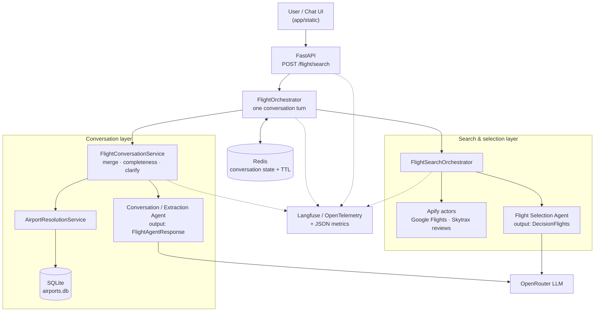

# AI Travel Agent

**A production-shaped, multi-turn LLM agent system for flight search.** A user describes a trip in natural language; the application collects the missing details across turns, resolves cities to airports, queries real flight data, and returns recommended flight options with written reasoning.

**Live demo: https://ai-travel-agent-gvce.onrender.com**

[](https://www.python.org/)
[](https://fastapi.tiangolo.com/)
[](./dockerfile)
[](https://github.com/AnisMelki/ai-travel-agent/actions/workflows/ci.yml)
[](https://ai-travel-agent-gvce.onrender.com)

> Clarification messages and the web UI are in French.

---

## Key Engineering Highlights

- **Two specialised agents, not one prompt** — a Conversation/Extraction Agent owns the dialogue and slot filling; a Flight Selection Agent ranks real search results. Each has its own prompt, schema and failure mode.
- **Structured LLM outputs end to end** — both agents use the Agents SDK `output_type` contract (`FlightAgentResponse`, `DecisionFlights`) validated by Pydantic. No free-text parsing anywhere.
- **Stateful multi-turn conversations** — conversation state is persisted in Redis with a TTL, updated immutably (`model_copy`) with a version counter, so a turn is a pure state transition.
- **Deterministic tool execution** — Apify actors and the airport database are called by the service layer, not exposed as agent tools, so the external-data path is testable and cannot be skipped or hallucinated by the model.
- **Failure handling as a design axis** — a domain exception hierarchy separates *user-correctable* errors (turned back into clarification questions) from *provider* errors (mapped to HTTP status codes, with internal details kept out of responses).
- **Retries on invalid model output** — `run_agent_with_retry` re-runs the agent on `ModelBehaviorError` and records the retry count as a metric.
- **Observability built into the request path** — Langfuse via OpenTelemetry traces every turn under a `session_id`, alongside JSON-logged latency, token usage and retry metrics.
- **Shipped, not a notebook** — Dockerised, deployed on Render, with a CI pipeline running Ruff, mypy and 196 tests behind an 80% coverage gate.

---

## Architecture



---

## The Two Agents

| | **Conversation / Extraction Agent** (`FlightAgent`) | **Flight Selection Agent** (`FlightAgentSelection`) |
|---|---|---|
| **Job** | Talk to the user and fill the slots | Rank real flight offers |
| **Input** | User message + last 8 history messages + current date | Serialized `FlightSearchResponse` (offers + airline review summaries) |
| **Output type** | `FlightAgentResponse` — `type`, `patch` (changed fields only), optional `reply` | `DecisionFlights` — up to 2 `selected_indexes` + `reasoning` |
| **Prompt** | `prompt_agent_flights.jinja2`, rendered per turn with live context | `prompt_selection_flight.jinja2`, static |
| **Tools** | None — resolution and search are the service layer's job | None — it only reasons over data it was given |
| **Failure mode** | Empty/invalid patch → `FlightExtractionOutputError`, retried once | Invalid or out-of-range indexes → rejected by the Pydantic validator |

Keeping the agents tool-free is deliberate: the model decides *what the user meant* and *which offer is better*, while the application decides *when* to hit Redis, SQLite and Apify. That boundary is what makes the flow unit-testable.

---

## Request Lifecycle

1. `POST /flight/search` reads `X-Conversation-ID` (or generates one), returns it with the response, and opens the Langfuse root span.
2. `FlightOrchestrator` loads the conversation state from Redis (or creates one) and appends the user message to the history.
3. `FlightConversationService` either interprets the message as an answer to a pending clarification, or runs the extraction agent and merges the returned `patch` into the state.
4. While `origin`, `destination` or `departure_date` are missing, the turn ends — with the agent's own `reply` when it has one, otherwise with a deterministic clarification question.
5. Once complete, both cities are resolved to IATA codes. An unknown or ambiguous city becomes a clarification (with selectable airport options), not an error.
6. The resolved request goes to the Apify flight actor, airlines are enriched with Skytrax review summaries, and the Flight Selection Agent returns its picks and reasoning.
7. State is persisted on every turn and the conversation key is deleted after a successful search.

**Layers**

| Layer | Responsibility |
|-------|----------------|
| `app/router` | HTTP transport: conversation id header, root trace span, delegation. |
| `app/service/orchestrator.py` | One conversation turn: load state, run the service, persist, then search. |
| `app/service/conversation_service` | Extraction, state merging, completeness check, airport resolution. |
| `app/agent` | Agent definitions, prompt rendering, retry wrapper, startup bootstrap. |
| `app/tools` | Apify clients for flights and airline reviews. |
| `app/repositories` | Redis conversation state and SQLite airport lookups. |
| `app/schema`, `app/exception` | Pydantic contracts and the domain exception hierarchy. |
| `app/handlers` | Exception-to-HTTP mapping with a uniform `ErrorResponse` body. |

---

## Tech Stack

| Area | Technology |
|------|------------|
| Backend | Python 3.14, async/await |
| AI / Agents | OpenAI Agents SDK (`openai-agents`), OpenRouter via `AsyncOpenAI`, Jinja2 prompt templates |
| API | FastAPI, Uvicorn |
| Validation | Pydantic v2, pydantic-settings |
| State / Cache | Redis (`redis.asyncio`) with TTL-based conversation state |
| External Data | Apify (Google Flights scraper, Skytrax airline reviews) |
| Reference Data | SQLite + SQLAlchemy 2 (async, `aiosqlite`) airport database |
| Observability | Langfuse, OpenInference OpenAI Agents instrumentation (OpenTelemetry), `python-json-logger` |
| Testing | pytest, pytest-cov |
| Linting / Types | Ruff, mypy |
| CI | GitHub Actions (uv, ruff, mypy, pytest with coverage gate) |
| Containerization | Docker (`python:3.14-slim`), Docker Compose for local Redis |
| Deployment | Render (web service) |
| Frontend | Vanilla HTML/CSS/JavaScript served by FastAPI |

---

## Project Structure

```
app/
  main.py                     FastAPI app, lifespan, static UI, /health, custom /docs
  agent/
    bootstrap.py              Startup/shutdown for LLM, Redis, Apify and Langfuse clients
    flight_agent.py           Extraction and selection agent definitions
    agent_runner.py           Retry wrapper + latency/token/retry metrics
  router/flight_router.py     POST /flight/search, dependency wiring, root trace span
  service/
    orchestrator.py           One conversation turn end to end
    flight_agent_service.py   Flight search + agent selection + response building
    conversation_service/     Extraction, state merging, completeness, airport resolution
  tools/
    apify_flights.py          Apify flight-search actor client
    apify_airlines.py         Apify Skytrax review actor client
    flight_selection.py       Combines flight results with airline review summaries
  repositories/               Redis conversation repository, airport repository
  schema/                     Pydantic request/response/state models
  exception/                  Domain exceptions, error translation, clarification builder
  handlers/                   Exception-to-HTTP handlers
  observability/              LLM metrics model and structured metric logging
  template/                   Jinja2 agent prompts
  database/ model/ data/      SQLite engine, airport ORM model, airport CSV source
  static/                     Chat web interface
tests/                        Unit tests for services, agents, tools and routes
.github/workflows/ci.yml      Lint, type-check and test pipeline
dockerfile                    Application image
docker-compose.yml            Local Redis
```

---

## Conversation State

- The conversation id comes from the `X-Conversation-ID` header; the API generates one when it is missing and always returns it. The web UI generates its own so a thread survives a failed first turn.
- `FlightConversationState` (collected fields, IATA codes, status, version, pending clarification, history) is stored as JSON in Redis under `flight:conversation:{id}` with the TTL from `REDIS_CONVERSATION_TTL_SECONDS`.
- Merging normalizes city names and clears a resolved airport code whenever its city changes, so a correction can never leave a stale IATA code behind.
- A clarification stores its reason, target field and allowed airport codes. Answers to `missing_field` and `airport_not_found` re-enter the extraction flow; `ambiguous_airport` answers are matched against the allowed codes, and an invalid choice simply re-asks.
- The last eight history messages are injected into the extraction prompt as the agent's only memory. The conversation key is deleted after a successful search.

---

## Error Handling

- Domain exceptions live in `app/exception/flight_exceptions.py`, split between `UserCorrectableFlightError` (unknown or ambiguous airport, empty results, invalid agent output) and `ProviderError` (Apify failures and timeouts).
- User-correctable errors become clarification responses so the conversation can continue instead of failing.
- Apify failures are wrapped at the client boundary. Airline review fetching is best-effort: one failing airline is logged and skipped.
- `run_agent_with_retry` retries the agent when the model returns structurally invalid output.
- Pydantic validates the contract: no past departure dates, no return before departure, no identical origin and destination, normalized IATA codes.
- `register_exception_handlers` maps exceptions to status codes: empty search → 404, user-correctable → 400, provider timeout → 504, provider error → 502, storage failure → 503, anything else → 500. Provider messages are replaced by generic ones so internal ids stay in the logs.

---

## Observability

- `OpenAIAgentsInstrumentor` captures every agent run as OpenTelemetry spans exported to Langfuse.
- `/flight/search` opens a `flight-chat-response` root span with the user message as input and the response as output, using the conversation id as the Langfuse `session_id` so all turns of a conversation group together.
- Nested spans cover orchestration, extraction, the search chain and the Apify calls.
- `LLMCallMetrics` records conversation id, agent name, model, latency, success flag, retry count, input/output/total tokens and error type; token counts come from the Agents SDK run hooks. Metrics and application logs are emitted as JSON.
- An incomplete Langfuse configuration only disables tracing — it does not break the request path.

---

## Evaluation

The traces and metrics above provide the raw signal; a systematic evaluation harness is **not implemented yet**. This is how the system is intended to be measured.

| Metric | What it measures | Status |
|--------|------------------|--------|
| **Extraction accuracy** | Per-field precision/recall of `origin`, `destination`, `departure_date`, `return_date` against a labelled set of utterances, including corrections ("actually, leave from Lyon"). | Planned — needs a labelled dataset |
| **Clarification accuracy** | How often a clarification is asked when a field is genuinely missing or ambiguous, versus asked needlessly or skipped. | Planned |
| **Task completion rate** | Share of conversations reaching a successful search, and the number of turns it took. | Planned — derivable from Langfuse sessions |
| **Selection quality** | Whether `DecisionFlights.reasoning` is consistent with the offers it cites (price, duration, layovers, reviews) — LLM-as-judge or human review. | Planned |
| **Latency p50/p95** | Per-agent call and per-turn end to end. | Partially available — `LLMCallMetrics.latency_ms` is logged per call; percentiles are not aggregated |
| **Token usage / cost** | Input, output and total tokens per turn and per conversation. | Available — logged per call and visible in Langfuse |
| **Retry rate** | Frequency of `ModelBehaviorError` retries, as a proxy for prompt/schema drift. | Available — `retry_count` is logged per call |
| **Provider error rate** | Apify failures, timeouts and empty result sets. | Available — typed exceptions and JSON logs |

The first step towards the planned items is a fixture set of conversations replayed against stubbed Apify and LLM providers.

---

## CI/CD

[.github/workflows/ci.yml](.github/workflows/ci.yml) runs on every push and pull request to `main`: `uv sync --locked`, `ruff check .`, `mypy app`, then `pytest` with an 80% coverage gate. Tests use placeholder environment variables, so no secrets are needed.

Render builds and deploys `main`; the deployment settings live on Render, not in the repository.

---

## Running Locally

**Prerequisites:** Python 3.14, [uv](https://docs.astral.sh/uv/), and a reachable Redis instance.

```bash
git clone https://github.com/AnisMelki/ai-travel-agent.git
cd ai-travel-agent

# Create the virtual environment and install the locked dependencies
uv sync
```

Start Redis (the bundled Compose file provides one):

```bash
docker compose up -d redis
```

Create a `.env` file at the repository root:

```env
OPENROUTER_API_KEY=your_openrouter_key
OPENROUTER_BASE_URL=https://openrouter.ai/api/v1
OPENROUTER_MODEL=your_model_id
LLM_TIME_OUT=30
LLM_MAX_RETRY=3
APIFY_API_TOKEN=your_apify_token
REDIS_URL=redis://localhost:6379/0
REDIS_CONVERSATION_TTL_SECONDS=3600

# Optional: tracing is disabled when these are not set
LANGFUSE_PUBLIC_KEY=your_public_key
LANGFUSE_SECRET_KEY=your_secret_key
LANGFUSE_BASE_URL=https://cloud.langfuse.com
LANGFUSE_ENVIRONMENT=development
```

Run the API:

```bash
uv run uvicorn app.main:app --reload
```

Then open:

- `http://localhost:8000/` — chat interface
- `http://localhost:8000/docs` — API documentation
- `http://localhost:8000/health` — health check

The airport database (`app/database/airports.db`) ships with the repository. It can be rebuilt from the bundled CSV with:

```bash
uv run python app/script/import_airports.py
```

---

## Docker

Build and run the application image:

```bash
docker build -t ai-travel-agent .
docker run --rm -p 8000:8000 --env-file .env ai-travel-agent
```

The image is based on `python:3.14-slim`, installs the project with pip, exposes port 8000 and starts Uvicorn on `0.0.0.0:8000`. `docker-compose.yml` only provisions Redis (with AOF persistence) for local development; point `REDIS_URL` at a host reachable from the container.

---

## Testing

```bash
# Full test suite
uv run pytest

# With coverage, as in CI
uv run pytest --cov=app --cov-report=term-missing --cov-fail-under=80

# Lint and type checks
uv run ruff check .
uv run mypy app
```

The suite currently contains 196 tests covering the orchestrator, conversation service, extraction and selection agents, Apify clients, repositories, exception handling and the HTTP route, at roughly 85% statement coverage.

---

## Deployment

The application runs on Render as a single web service serving both the API and the chat UI: **https://ai-travel-agent-gvce.onrender.com**

Configuration is supplied entirely through environment variables. The airport database is read-only reference data shipped inside the image; all mutable conversation state lives in Redis.

---

## Engineering Decisions

- **Two agents instead of one** — dialogue management and ranking have different inputs, different output schemas and different failure modes. Splitting them keeps each prompt small, makes the extraction step cheap to retry, and means a bad ranking never corrupts the conversation state.
- **Agents have no tools** — airport lookup and Apify calls are ordinary service calls behind the agents. The model cannot skip, duplicate or hallucinate a data fetch, and every external call is directly unit-testable. (The Agents SDK also swallows tool exceptions into strings by default, which would have hidden real provider errors from the HTTP layer.)
- **Structured `output_type` over free-text parsing** — schema violations surface as a typed error that can be retried, instead of silently producing a malformed state.
- **Patch-based state updates** — the agent returns only what the current message changed, so an unrelated field can never be overwritten by a partially-attentive model. Merges are immutable (`model_copy`) with a version counter, so no turn mutates state another turn is reading.
- **Redis for conversation state, SQLite for airports** — conversation state is mutable, per-user and short-lived (TTL), so it belongs in a cache; the airport table is read-only reference data, so it ships in the image with no infrastructure cost.
- **Clarifications derived from typed errors** — "unknown city" and "ambiguous city" are raised as `UserCorrectableFlightError` subclasses and translated once into clarification responses, so the same condition drives both the conversation flow and the HTTP status mapping without duplicated logic.
- **Dependency injection via FastAPI `Annotated[..., Depends(...)]`** — the whole object graph is wired at the edge, so services take injectable collaborators and factories rather than constructing their own, which is what makes the 196 unit tests possible without live providers.
- **Fully async I/O** — Redis, SQLAlchemy (`aiosqlite`), Apify and the LLM client are all async, so a turn blocked on a slow scraper does not block the event loop.

---

## Future Improvements

These are not implemented today:

- **Parallelise the airline review calls** — `AirlineReviewService.get_airline_summaries` currently fetches Skytrax reviews one airline at a time in a sequential loop. Running them concurrently (`asyncio.gather` with a bounded semaphore, keeping the existing best-effort per-airline error handling) would cut the search latency roughly by the number of distinct airlines returned.
- **Extend the system with more agents** — the two-agent split (conversation/extraction and selection) generalises to the rest of a trip: a hotel agent, an Airbnb agent and a weather agent, each with its own Apify actor or API, its own prompt and its own structured output type, coordinated by the existing orchestrator so a single conversation can plan flights, accommodation and dates together.
